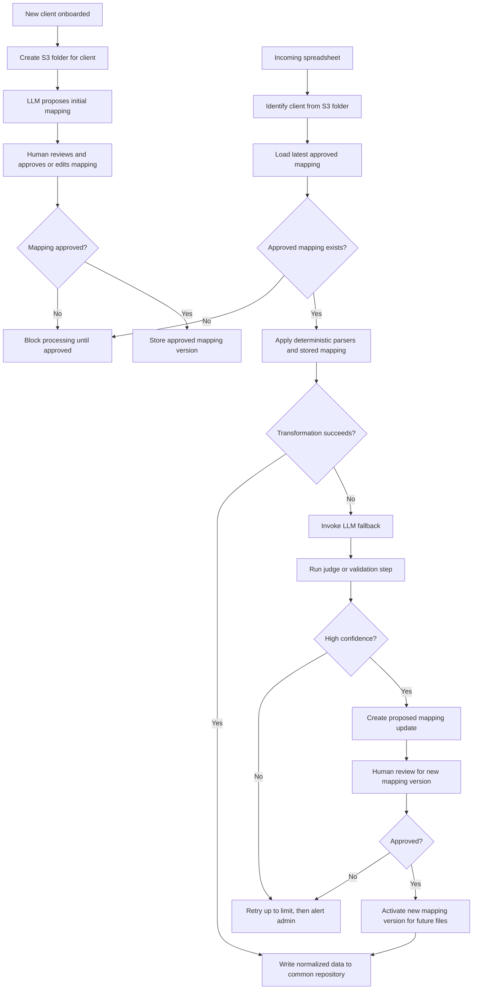

# PolicySync Intelligence

## Project Summary

PolicySync Intelligence is an AI-assisted data normalization system for ingesting third-party insurance spreadsheets and consolidating them into a common data repository.

The system is designed for a real-world constraint: incoming files come from outside companies, and their formats cannot be controlled. Each carrier or client may use different column names, layouts, and conventions for the same underlying business concepts. The goal of the system is to map those incoming spreadsheets into a canonical internal schema with high reliability.

This project uses a hybrid approach:

- Deterministic logic for known transformations such as parsing names, dates, addresses, and standard identifiers
- LLM-based reasoning for onboarding new client formats and interpreting ambiguous field meanings

For example:

- A field like `Name` may be parsed deterministically into first, middle, and last name using specialized libraries
- A field like `AccountNo` may require LLM reasoning to determine that it maps to `account_number`

## Main Goals

- Accept spreadsheet formats from external companies without requiring them to change
- Normalize incoming policy data into a shared internal schema
- Minimize recurring LLM usage by storing reusable document mappings
- Require human approval before a new client mapping becomes active
- Improve over time through controlled mapping versioning and review

## Mapping-Centered Design

The core idea is that AI is used mainly during onboarding and exception handling, not on every file.

When a new client is onboarded:

1. A new folder is created in S3 for that company
2. A mapping is generated for files received in that folder
3. The mapping is stored in the system and tied to that client folder
4. A human reviews the proposed mapping and approves or edits it
5. Only approved mappings are allowed to process production files

After approval, future files for that client should be processed using the stored mapping without needing to call an LLM for normal cases.

## Mapping Versioning and Approval

Mappings should be versioned and treated as controlled configuration.

- Every client has a current approved mapping version
- New or updated mappings must go through human review
- Clients without an approved mapping are blocked from automated processing
- Mapping history should be preserved for auditability and rollback

This makes the system safer, more explainable, and less expensive than relying on an LLM for every ingestion event.

## Workflow Diagram

## Fallback and Self-Improvement Flow

Even after a mapping is approved, some files may still fail because a value is unusual or hard to interpret, such as a malformed address, unexpected name format, or new field variation.

In that case, the system can:

1. Detect that the current mapping failed
2. Invoke an LLM to propose an interpretation or updated mapping
3. Use an LLM judge or validation stage to score the proposed result
4. If the score is high enough, create an updated mapping version for review
5. After approval, use the new version for future files

If the same field or mapping issue fails repeatedly, the system should stop retrying after a small limit, such as 3 attempts, and alert a human administrator for manual correction.

## Suggested Architecture

1. Receive client spreadsheets in an S3 folder specific to the company
2. Identify the client based on the folder or ingestion source
3. Look up the latest approved mapping for that client
4. If no approved mapping exists, block processing and request onboarding review
5. Apply deterministic transformations and parsers
6. Apply the stored mapping to transform the spreadsheet into the canonical schema
7. If transformation fails, invoke LLM fallback and validation
8. Store normalized records, mapping outcomes, and audit metadata
9. Route mapping changes through human approval before activation

## Implementation Suggestions

- Define a canonical policy schema before building client-specific mappings
- Store mappings as versioned JSON or YAML with clear source-to-target field rules
- Separate field classification from field transformation so each can be tested independently
- Use deterministic libraries first for names, addresses, dates, phone numbers, and identifiers
- Limit LLM use to onboarding and exception recovery to control cost and variance
- Add confidence thresholds so weak LLM suggestions never auto-promote themselves
- Keep a review queue for new mappings and mapping revisions
- Track which fields fail most often so you can improve deterministic handling over time
- Add retry limits and human alerts for repeated failures on the same field or file

## AI Concepts Learned By Building This

Implementing this project would teach several important AI and system design concepts:

- Schema matching and canonical data modeling
- LLM-assisted field classification
- Hybrid AI systems that combine deterministic logic with model reasoning
- Confidence scoring and judge-based validation
- Human-in-the-loop approval workflows
- Versioned AI-generated configuration
- Exception handling and fallback design
- Data lineage, auditability, and controlled automation
- Practical cost reduction by minimizing unnecessary LLM calls

## Recommended First Phase

A strong first milestone would be:

- Define the canonical schema
- Support onboarding for one sample carrier spreadsheet
- Generate a proposed mapping with an LLM
- Require human approval before activation
- Process future files using the stored mapping without LLM calls
- Add one fallback path with retry limits and admin alerting

This would prove the core architecture while keeping the first version manageable.
